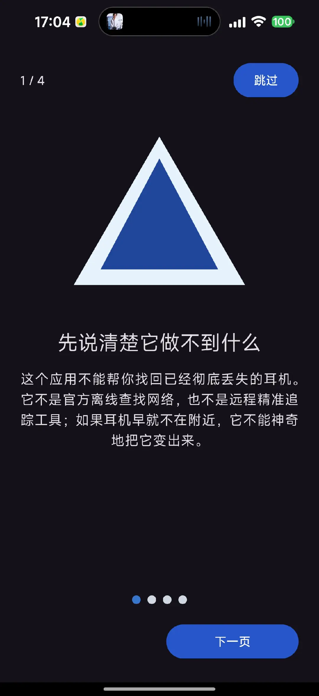
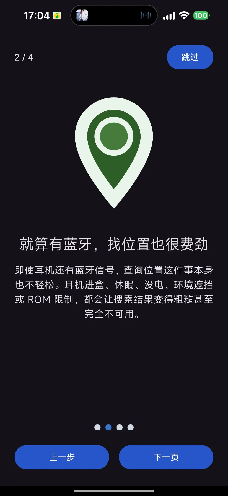
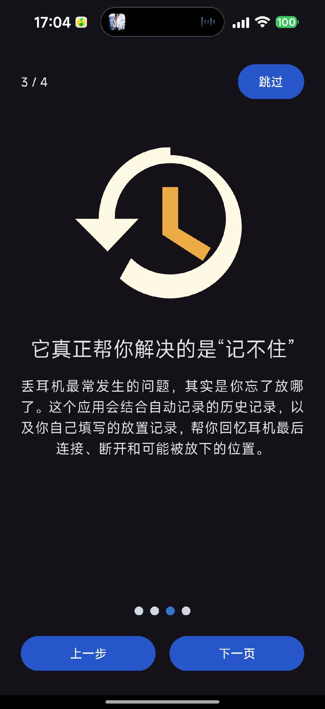
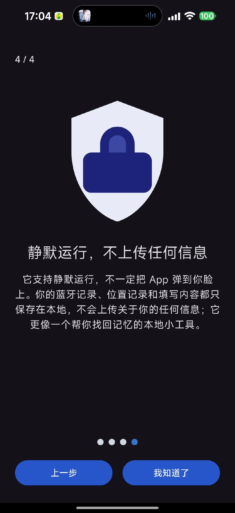
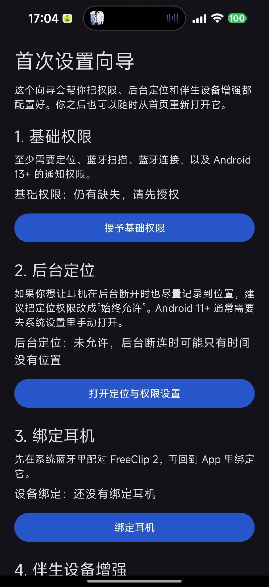
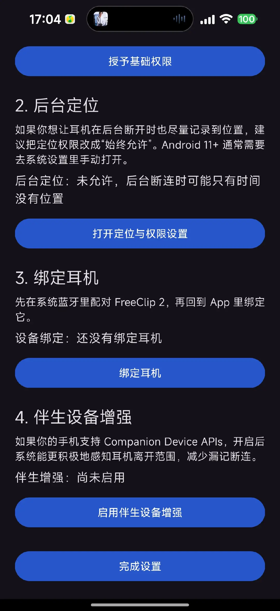
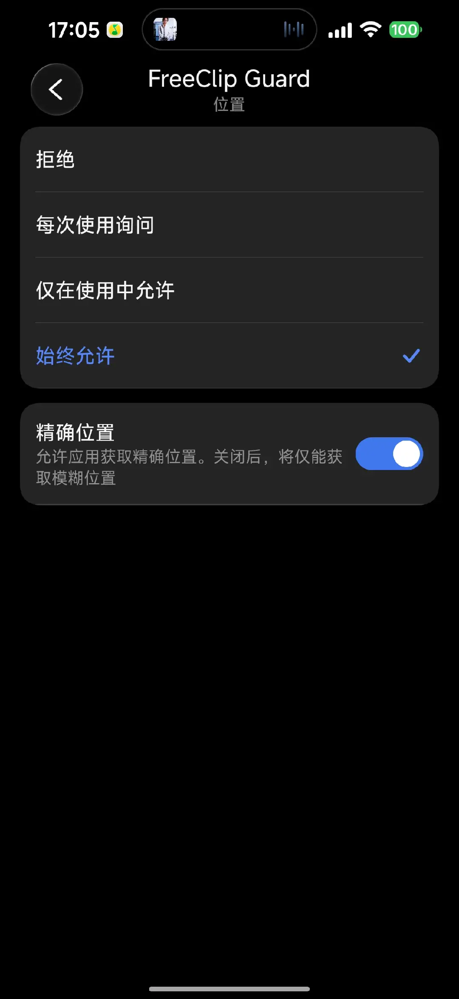
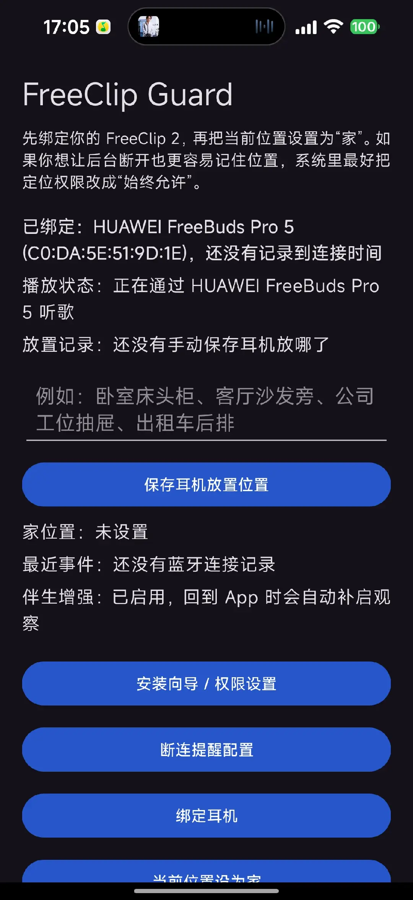
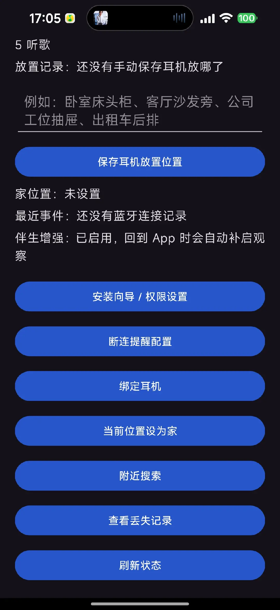

# FreeClip Guard Android

用于 `耳机 + 非华为的安卓手机` 的防丢提醒、最后位置记录、附近搜索。

## 目标

- 绑定你已经配对过的耳机
- 监听蓝牙断开事件
- 记录断开时手机的最后已知位置
- 在“家”以外场景弹出遗落提醒
- 回到现场后通过经典蓝牙扫描做近距离搜索
- 提供首次设置向导，集中处理权限、后台定位和伴生设备增强
- 首次进入会先展示 4 页产品边界与隐私说明引导，再进入设置向导
- 在支持的 Android 12+ 机型上启用 Companion Device 增强存在感知
- 首页显示耳机连接/听歌状态，前台打开 App 时会持续刷新
- 遗落通知和历史记录支持优先拉起高德地图查看最后位置，不安装高德时回退系统地图
- 支持自定义耳机断开提示词，并可通过悬浮弹窗在其他界面上直接提醒

## 为什么用 Java

- 我对 Java 更熟悉，维护成本更低
- Android 蓝牙、位置、通知、Room 都可以直接用 Java 实现
- UI 选 `XML + AppCompat`，避免 Kotlin/Compose 学习成本

## 当前实现边界

- 适合做“最后看到位置 + 断连提醒 + 近距离搜索”
- 不包含华为 `离线查找网络`、`星闪精确查找`、`查找设备` 能力
- `附近搜索` 依赖耳机仍可被扫描到；如果耳机关机、没电、放进盒子或停止广播，搜索可能失败
- 背景检测目前依赖系统蓝牙连接广播；后续可再接入 `CompanionDeviceManager` 强化后台存在感知
- `CompanionDeviceManager` 增强目前要求 `Android 12 (API 31)+` 且系统开放相关功能；不同厂商 ROM 的表现可能不同
- 由于 Google Play 对后台定位权限审核较严，正式上架前需要补充清晰的权限说明与隐私政策

## 工程结构

- `app/src/main/java/com/example/freeclipguard/MainActivity.java`：主页，总览绑定设备、家位置、最后事件
- `app/src/main/java/com/example/freeclipguard/OnboardingActivity.java`：首次设置向导，负责权限、后台定位、伴生增强
- `app/src/main/java/com/example/freeclipguard/BindDeviceActivity.java`：从已配对设备中绑定目标耳机
- `app/src/main/java/com/example/freeclipguard/NearbySearchActivity.java`：附近搜索与 RSSI 热度提示
- `app/src/main/java/com/example/freeclipguard/EventHistoryActivity.java`：查看最近遗落事件
- `app/src/main/java/com/example/freeclipguard/companion/CompanionAssociationManager.java`：伴生设备关联与存在观察
- `app/src/main/java/com/example/freeclipguard/companion/FreeClipCompanionService.java`：伴生设备离开范围时的系统回调
- `app/src/main/java/com/example/freeclipguard/receiver/BluetoothStateReceiver.java`：监听蓝牙连接/断开
- `app/src/main/java/com/example/freeclipguard/data`：Room 数据库与配置存储

## 应用截图说明

下面这些截图按用户真实使用流程排列，方便你快速理解这个 App 的定位和交互设计。

### 1. 首次进入的产品边界说明

这 4 页不是功能介绍，而是先把产品边界讲清楚：

- 它不能替代官方离线查找网络
- 就算有蓝牙，定位耳机也并不轻松
- 它真正解决的是“忘了放哪”的问题
- 数据静默运行、全部保存在本地，不上传个人信息

| 第 1 页：做不到什么 | 第 2 页：蓝牙定位不容易 |
| --- | --- |
|  |  |

| 第 3 页：真正解决“记不住” | 第 4 页：静默运行与本地隐私 |
| --- | --- |
|  |  |

### 2. 首次设置向导

引导页结束后，会进入首次设置向导。这里把权限、后台定位、设备绑定、伴生设备增强集中放在一起，避免用户在系统设置里来回找。

| 向导上半部分：基础权限与后台定位 | 向导下半部分：绑定耳机与伴生增强 |
| --- | --- |
|  |  |

如果想让后台自动记录位置更可靠，系统里建议把定位权限设置成“始终允许”，并打开精确位置：

### 3. 首页总览与日常使用

首页是这个 App 的核心工作台。它会集中展示：

- 当前绑定的耳机和最近连接时间
- 当前播放状态
- 手动填写的“耳机放哪了”记录
- 家位置、最近事件、伴生增强状态
- 进入设置、绑定、搜索、历史记录等所有主要入口

| 首页上半部分：状态总览与手动记录 | 首页下半部分：常用操作入口 |
| --- | --- |
|  |  |

## 导入方式

1. 用 Android Studio 打开 `freeclip-guard-android`
2. 使用 IDE 自带的 Gradle/JDK 17 同步项目
3. 安装到 Android 真机后，首次启动先走 `安装向导 / 权限设置`
4. 先去系统蓝牙把 `FreeClip 2` 配对好，再在 App 中绑定
5. 如果你的手机是 Android 12+，在向导里再点一次 `启用伴生设备增强`

## 建议真机验证清单

- 在家里设置一次“当前地点为家”
- 戴着耳机出门，关掉耳机或让耳机离开连接范围，确认是否收到提醒
- 在耳机播放音乐时打开首页，确认状态会显示“正在通过 xxx 听歌”
- 在楼道、房间、车内分别测试一次 `附近搜索`
- 点开遗落通知，确认会优先打开高德地图并落在最后位置点上
- 打开“断连提醒配置”，修改提示词并开启悬浮弹窗权限；随后断开耳机，确认在其他界面上也能弹出自定义提醒
- 验证不同机型上 `ACTION_ACL_DISCONNECTED` 是否稳定触发
- 如果手机支持 Companion Device，再测一次“耳机离开范围但系统蓝牙广播不稳定”时能否仍记录事件

## 后台定位提醒

- 如果你希望耳机在后台断开时也尽量记住最后位置，系统里最好把定位权限调成“始终允许”
- 这个 MVP 当前不会自动走完整的后台定位授权引导；如果后台权限没开，断连事件仍会保存，但位置可能为空
